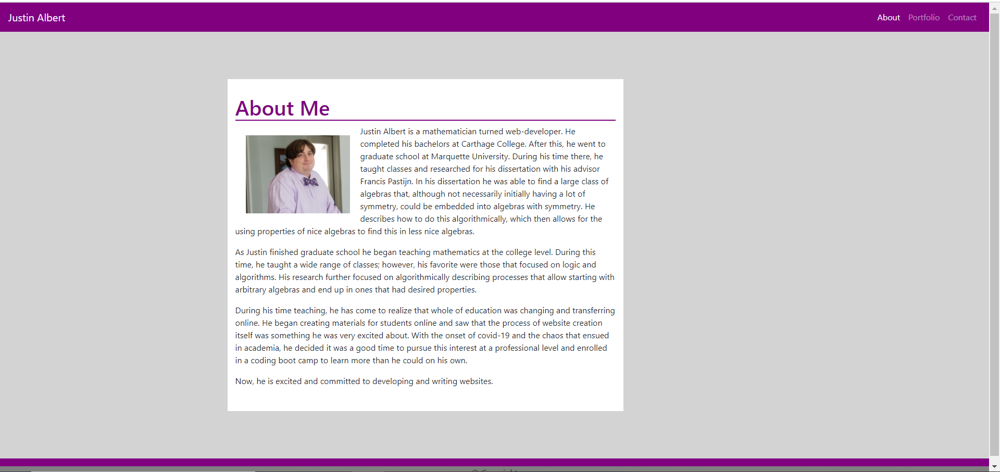

# Employee Tracker 
## Table of Contents 
 * [About](#About) 
 * [Usage](#Usage) 
 * [Contact](#Contact) 
 * [License](#License) 
  
## About 
 In this project I provide biographical information, educational and work experiences meant to highlight my abilitites as a potential employee.  There is an about me page, my portfolio gallery, my resume and a contact form.
  
 
## Usage 
 In order to view this project as a user, you will go to the [deployed project](https://jalbert12485.github.io/portfolio/).  When there, you can use the navigation bar to go to the desired about me, portfolio, contact or resume pages.  In the portfolio page you will be given a brief overview of some of the work I have completed.  You can then use the provided links to travel to the github repository or the deployed links.  In the contact page, you can click the icons to be redirected to my linkedIn or Github pages as well as get my email and phone number. 

 If you would like to use this repo as developer to create your own portfolio.  Feel free to do so, provided you supply your own information to the portfolio.  You can clone this repository at [GitHub](https://github.com/jalbert12485/employee_tracker.git) 
```sh 
git clone https://github.com/jalbert12485/employee_tracker.git
 ```    
## Contact 
 If you would like more information please contact me at [email](mailto:jalbert@carthage.edu).  Any additional information you would like to give me in your email will be greatly appreciated.
## License 
 This is free and unencumbered software released into the public domain. Anyone is free to copy, modify, publish, use, compile, sell, or distribute this software, either in source code form or as a compiled binary, for any purpose, commercial or non-commercial, and by any means. 
 
 In jurisdictions that recognize copyright laws, the author or authors of this software dedicate any and all copyright interest in the software to the public domain. We make this dedication for the benefit of the public at large and to the detriment of our heirs and successors. We intend this dedication to be an overt act of relinquishment in perpetuity of all present and future rights to this software under copyright law. 
 
 THE SOFTWARE IS PROVIDED 'AS IS', WITHOUT WARRANTY OF ANY KIND, EXPRESS OR IMPLIED, INCLUDING BUT NOT LIMITED TO THE WARRANTIES OF MERCHANTABILITY, FITNESS FOR A PARTICULAR PURPOSE AND NONINFRINGEMENT. IN NO EVENT SHALL THE AUTHORS BE LIABLE FOR ANY CLAIM, DAMAGES OR OTHER LIABILITY, WHETHER IN AN ACTION OF CONTRACT, TORT OR OTHERWISE, ARISING FROM, OUT OF OR IN CONNECTION WITH THE SOFTWARE OR THE USE OR OTHER DEALINGS IN THE SOFTWARE. 
 
 For more information, please refer to <https://unlicense.org> 
